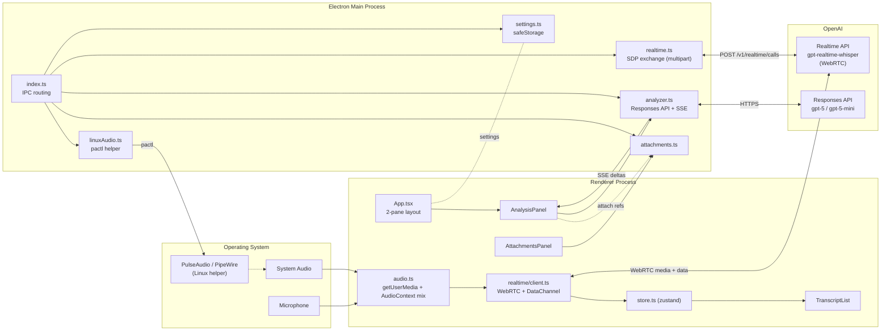

# MeetingAssistant

[日本語](README.md) | **English**

A desktop app that captures your mic + system audio during meetings, transcribes everything in real time via the OpenAI Realtime API (WebRTC), and lets an AI continuously organize what's being said — running minutes, action items, points to clarify, suggestions for what to discuss next, and a final polished meeting record once you're done.

While you're talking, the AI keeps updating "what topic is being discussed, what's the live agenda, and what should you ask next." When the meeting ends, one click turns the running notes into a clean final write-up.

[](https://github.com/TakanariShimbo/meeting-assistant/releases)
[](LICENSE)

---

## Contents

- [Features](#features)
- [Requirements](#requirements)
- [Installation](#installation)
- [First run & basic flow](#first-run--basic-flow)
- [Settings](#settings)
- [Audio modes & Linux audio setup](#audio-modes--linux-audio-setup)
- [Attachments](#attachments)
- [Cost guide](#cost-guide)
- [Troubleshooting](#troubleshooting)
- [Architecture](#architecture)
- [Development](#development)
- [Release](#release)
- [Known limits & roadmap](#known-limits--roadmap)
- [License](#license)

---

## Features

- **Real-time transcription** via OpenAI Realtime API (`gpt-realtime-whisper`, WebRTC). Partial text streams into the left pane while you're still speaking; finalized utterances stack below.
- **Three input modes**: mic only / system audio only / mic + system mixed (Web Audio `AudioContext` mixing).
- **Live analysis**: every time enough transcript accumulates, `gpt-5-mini` (default) re-organizes the meeting in place
  - Category (hearing / ideation / interview / 1on1 / progress-check / other)
  - Phase (intro / discussion / point organizing / converging / closing)
  - Discussion flow (3–7 steps with the current one highlighted)
  - Current topics / key facts / running minutes / notable quotes
  - **Points to clarify** (in full sentences you can read out loud)
  - **Next suggestions** (full sentences you can propose at the meeting)
  - Decisions / action items
- **Final analysis**: when the meeting ends, `gpt-5` (default) re-reads the whole transcript and produces a polished final write-up + next-meeting agenda.
- **Streaming UI**: structured output (JSON Schema strict) is consumed via `text/event-stream`; partial JSON is parsed best-effort so cards fill in as the model writes them.
- **Attachments**: drag-and-drop text / images (PNG/JPEG/WebP) / PDFs to feed the analyzer. Attachments are sent as a stable prefix so OpenAI's prompt cache reuses them across analyses.
- **Optional Web Search**: toggle `web_search` independently for Live and Final.
- **Settings UI**:
  - API key encrypted via OS keychain (`safeStorage`)
  - Language hint for transcription (auto / ja / en / zh / ko / es / fr / de / it / pt / ru)
  - Independent model + reasoning effort + web search for Live and Final
  - Per-device mic / system-audio selection
- **Linux audio helper**: load PulseAudio null-sink + remap-source + loopback modules from the GUI; toggle "capture all apps automatically" to flip the system default sink.
- **Three OS packages**: Linux (AppImage / .deb), macOS (dmg, arm64 + x64), Windows (NSIS installer).

---

## Requirements

| OS | Supported | Needs |
|---|---|---|
| Linux (PulseAudio / PipeWire) | ✅ | `pactl` (pulseaudio-utils or pipewire-pulse) for system-audio capture |
| macOS 12+ (Intel / Apple Silicon) | ✅ | Mic permission; virtual audio device (BlackHole / Loopback) for system audio |
| Windows 10 / 11 | ✅ | Mic permission; Stereo Mix or VB-CABLE for system audio |

An OpenAI API key is required. Your account must have access to the Realtime API and the Responses API (gpt-5 family).

---

## Installation

Grab the latest build from the [Releases](https://github.com/TakanariShimbo/meeting-assistant/releases) page.

### Linux

**Debian / Ubuntu (.deb)** — recommended (auto-registers in Activities):

```bash
sudo apt install ./meeting-assistant_<version>_amd64.deb
```

**AppImage** — portable, runs on any distro:

```bash
chmod +x MeetingAssistant-<version>.AppImage
./MeetingAssistant-<version>.AppImage
```

For system-audio capture you also need `pactl`:

```bash
sudo apt install pulseaudio-utils    # or: pipewire-pulse
```

### macOS

| Processor | File |
|---|---|
| Apple Silicon (M1/M2/M3/M4) | `MeetingAssistant-<version>-arm64.dmg` |
| Intel | `MeetingAssistant-<version>.dmg` |

1. Open the dmg and drag to Applications.
2. First launch shows an **unsigned-app warning** — `Control+click → Open` to allow.
3. Grant mic permission when prompted.
4. For system audio, install a virtual driver such as [BlackHole](https://github.com/ExistentialAudio/BlackHole), set it up as a Multi-Output Device, and pick it as the "system audio" device in settings.

### Windows

Download `MeetingAssistant-Setup-<version>.exe` and run it.

- If SmartScreen complains, click **More info → Run anyway** (it's unsigned).
- Launch from the Start menu.
- For system audio, enable Stereo Mix or install [VB-CABLE](https://vb-audio.com/Cable/).

---

## First run & basic flow

1. Launch the app — the main window opens with two panes (left: transcript / attachments, right: analysis).
2. Open **Settings** from the header and save your OpenAI API key.
3. Pick an **audio mode** (mic only / system only / mic + system).
4. Optionally pick specific devices if you have multiple mics or audio outputs.
5. Click **Start** in the header — status flips to "connecting" then "connected".
6. Transcript starts streaming into the left pane.
7. Once enough text accumulates, Live analysis cards begin updating on the right.
8. When the meeting is over, click **Stop** → **Final analysis** to generate the polished write-up.

Drag the center divider to rebalance the two panes (persists in `localStorage`).

---

## Settings

Open via the **Settings** button in the header.

| Field | Description |
|---|---|
| OpenAI API key | A `sk-...` string. **Encrypted via OS keychain** on save (`safeStorage`). Falls back to plaintext JSON with a warning log if the keychain is unavailable. |
| Transcription language | Hint passed to the Realtime API (`audio.input.transcription.language`, ISO-639-1). **Auto** = auto-detect. |
| Audio mode | `mic only` / `system audio only` / `mic + system mixed` |
| Mic device | Picked from `enumerateDevices`. Empty = browser default. |
| System-audio device | Input device that carries system audio (Linux: `MeetingAssistant_Capture` / mac: BlackHole / Win: Stereo Mix etc.) |
| Live model | `gpt-5` / `gpt-5-mini` (default) / `gpt-5-nano` |
| Live reasoning effort | `minimal` / `low` (default) / `medium` / `high` |
| Live Web Search | Enables the `web_search` tool for Live analysis. |
| Final model | Same options. Default `gpt-5`. |
| Final reasoning effort | Same options. Default `medium`. |
| Final Web Search | Same as Live. |
| Realtime instructions | System prompt for the Realtime session (mostly for the conversational mode; transcription-only usually needs no change). |

API-key precedence: **settings file > `OPENAI_API_KEY` env var > none**.

Settings file location:
- Linux: `~/.config/meeting-assistant/settings.json`
- macOS: `~/Library/Application Support/meeting-assistant/settings.json`
- Windows: `%APPDATA%\meeting-assistant\settings.json`

---

## Audio modes & Linux audio setup

### Mic only

No special setup — just grant mic permission.

### System only / mic + system

You need a way to expose **system audio as an OS input device**.

**Linux (PulseAudio / PipeWire)** — set up in one click from the "Linux audio setup" section in Settings.

Under the hood it loads three PulseAudio modules:

| Module | Role |
|---|---|
| `module-null-sink` (`meeting_assistant`) | Virtual speaker — apps you want captured output here. |
| `module-remap-source` (`meeting_assistant_capture`) | Re-exposes the null sink's monitor as a **regular input device** (Chromium hides raw monitors). |
| `module-loopback` | Pipes the virtual sink back to the real speakers so you can still hear it. |

After setup:

1. Open the app → **Linux audio setup → Run setup**.
2. Open `pavucontrol`'s "Playback" tab → for each app you want to capture (Zoom, browser, …), switch its output to **MeetingAssistant_Sink**.
3. In Settings → pick **MeetingAssistant_Capture** as the system-audio device.
4. Flip **Capture all apps automatically** to make our virtual sink the system default — new apps go through it without per-app routing. Toggling off restores the previous default.

Prefer the CLI? `scripts/setup-linux-audio.sh` produces the same setup.

**macOS** — install a virtual audio driver such as [BlackHole](https://github.com/ExistentialAudio/BlackHole) and configure a Multi-Output Device in Audio MIDI Setup to route system audio through it.

**Windows** — enable Stereo Mix or install [VB-CABLE](https://vb-audio.com/Cable/) and select it as the system-audio input.

---

## Attachments

Drop meeting materials, prior minutes, or related notes to give the analyzer extra context.

- **How**: drag-and-drop into the "Attachments" section in the left pane, or use the file picker.
- **Formats**:
  - Text: `.txt`, `.md`, `.json`, … → read as UTF-8
  - Image: PNG / JPEG / WebP → sent as `input_image`
  - PDF: sent as `input_file` (OpenAI does OCR / extraction)
- **Caching**: attachments are placed as a stable prefix (a separate user message) so **OpenAI's prompt cache reuses them** — second and later analyses with the same attachment set pay much less for the attached content.

---

## Cost guide

Real cost varies a lot with model choice, meeting length, and attachment size. Rough order-of-magnitude for a 60-minute meeting on defaults (`gpt-realtime-whisper` + Live `gpt-5-mini/low` + Final `gpt-5/medium`):

| Item | Rough estimate |
|---|---|
| Realtime transcription | OpenAI Realtime API audio-input pricing — several hundred yen per hour |
| Live analysis | Tens of calls × small `gpt-5-mini` output. Prompt cache hits keep it down to ~1 yen / call. |
| Final analysis | One call. Full transcript + `gpt-5/medium`. Tens of yen typical. |

See [OpenAI Pricing](https://openai.com/api/pricing/) for exact numbers. To cut cost: drop Live to `gpt-5-nano` + `minimal`, turn Web Search off, drop Final reasoning to `low`.

---

## Troubleshooting

| Symptom | Cause / fix |
|---|---|
| Stuck on "connecting…" | Invalid API key or no Realtime access. Re-check the key in Settings. |
| "OpenAI API key is not set" | Save the key in Settings, or `export OPENAI_API_KEY=...` before launch. |
| Mic not picked up | Check OS mic permission. Confirm with `enumerateDevices` in the browser, or `arecord -l` on Linux. |
| System audio is silent | Linux: verify in pavucontrol that the source app's output is `MeetingAssistant_Sink`. mac: BlackHole visible as an input device? Win: Stereo Mix enabled? |
| Linux "Run setup" fails | Confirm `pactl --version` works. Install `pulseaudio-utils` or `pipewire-pulse`. |
| Analysis errors | Read the error message. 401 = invalid key / 429 = rate limit / 400 = model not available (gpt-5 family must be enabled on your account). |
| Analysis panel stuck on "reasoning…" | gpt-5 reasoning models start with a thinking phase. `high` effort can take tens of seconds. |
| Won't launch on Linux (sandbox error) | Dev only. `npm run dev` already passes `--no-sandbox`. If it still fails see "Development" below. |

---

## Architecture



### Responsibility matrix

| Module | Owns | Doesn't own |
|---|---|---|
| `main/index.ts` | Electron lifecycle, IPC handlers, permission handler, wiring the analysis progress emitter | Business logic |
| `main/realtime.ts` | Multipart SDP exchange with OpenAI Realtime API (API key never leaves main) | SDP generation / media management |
| `main/analyzer.ts` | Streaming POST to Responses API, SSE parsing, structured output (JSON Schema strict), partial-JSON best-effort parser, progress events | UI rendering |
| `main/settings.ts` | Settings JSON I/O, `safeStorage` encryption, `OPENAI_API_KEY` fallback | UI rendering |
| `main/attachments.ts` | In-memory attachment store, analyzer-shape conversion, size limits | I/O beyond reading |
| `main/linuxAudio.ts` | Spawns `pactl` to load/unload null-sink / remap-source / loopback and toggle default sink | macOS / Windows audio |
| `preload/index.ts` | `contextBridge` exposes `window.api` | Business logic |
| `renderer/src/App.tsx` | Two-pane layout, Start/Stop, settings open, analysis progress subscription | Business logic |
| `renderer/src/realtime/client.ts` | `RTCPeerConnection`, `oai-events` data channel, Realtime API event parsing, session JSON (mirrors RealtimeRG) | API-key storage |
| `renderer/src/audio.ts` | `getUserMedia` for mic / system; `mixed` mode joins via `AudioContext`; returns a cleanup fn | Device-selection UI |
| `renderer/src/store.ts` | zustand: transcript state, analysis results, errors, analysis progress | I/O |
| `renderer/src/components/*` | TranscriptList / SettingsPanel / AnalysisPanel / AttachmentsPanel / CopyButton / ErrorBoundary | Data fetching |
| `shared/types.ts` | `AppSettings` / `LanguageCode` / `AudioMode` / `LiveModel` / `ReasoningEffort` + Realtime model constants | Logic |
| `shared/analysis.ts` | `LiveAnalysis` / `FinalAnalysis` types + JSON schemas (OpenAI structured-output strict) | Analyzer implementation |
| `shared/channels.ts` | IPC channel names (`<domain>:<verb>`) | Payload types |
| `shared/attachments.ts` | Attachment `kind`/`mime`/`payload` shapes | File management |

### IPC channels

All defined in `src/shared/channels.ts`; called from the renderer via `window.api` (preload).

| Channel | Direction | Payload | Purpose |
|---|---|---|---|
| `settings:get` | renderer → main | — | Load settings (invoke) |
| `settings:save` | renderer → main | `SettingsUpdate` | Persist settings (invoke) |
| `realtime:exchange-sdp` | renderer → main | `SdpExchangeRequest` | Exchange WebRTC SDP offer/answer (only main knows the API key) |
| `analyze` | renderer → main | `AnalyzeRequest` | Kick off Live or Final analysis |
| `analyze:progress` | main → renderer | `AnalysisProgress` | Reasoning / output chars / partial result mid-stream |
| `attachment:list` / `add` / `remove` / `clear` | renderer → main | Attachment management |
| `linux-audio:status` / `setup` / `teardown` / `set-capture-default` | renderer → main | Linux audio helper |
| `clipboard:write-text` | renderer → main | string | Fallback when `navigator.clipboard` fails silently |

### Why WebRTC, not WebSocket

Unlike `whisper-anywhere` (WebSocket + custom PCM chunking), this app uses **WebRTC plus the Realtime API's multipart SDP exchange**. Reasons:

- Meetings stream audio for a long time → WebRTC's browser-optimized pipeline is cheaper CPU-wise than WebSocket.
- Conversation mode (assistant replies aloud) is left as a future option: `autoCreateResponse: false` for transcription-only, but the transceiver is `sendrecv` and the data channel + session config are already conversation-ready.
- SDP exchange carries the initial `session` JSON in the same `multipart/form-data` request, so there's no extra `session.update` round-trip.

The implementation deliberately tracks [RealtimeRG](https://github.com/lukasalexanderweber/RealtimeRG) (Kotlin) — `RtcTransport.kt`, `Signaling.kt`, `EventCodec.kt` — because that's a verified-working reference for the Realtime API; we don't substitute "sensible defaults" from general knowledge.

---

## Development

### Prerequisites

- Node.js 22+ (`.nvmrc` included)
- Linux dev only:
  - On environments without a SUID `chrome-sandbox` (many dev containers and some Ubuntu setups), `npm run dev` already passes `--no-sandbox`.
  - For system-audio testing, install `pulseaudio-utils` (or `pipewire-pulse`).

### Setup

```bash
nvm use
npm ci
```

### Run

```bash
# Once you've saved the API key in the GUI, you don't need this again.
OPENAI_API_KEY='sk-...' npm run dev
```

### Scripts

```bash
npm run dev           # electron-vite dev (with --no-sandbox)
npm run build         # bundle main / preload / renderer into out/
npm run typecheck     # tsc type-check (node + web)

npm run pack:dir      # unpacked dir under release/linux-unpacked/ for quick inspection
npm run pack:linux    # AppImage + .deb
npm run pack:mac      # dmg + zip (macOS only)
npm run pack:win      # NSIS exe (recommended on Windows)
```

### Source layout

```text
src/
├─ main/                       # Electron main
│  ├─ index.ts                 # bootstrap + IPC routing + permission handler
│  ├─ realtime.ts              # OpenAI Realtime API multipart SDP exchange
│  ├─ analyzer.ts              # Responses API streaming + structured output + partial JSON parser
│  ├─ settings.ts              # safeStorage encryption + JSON persistence
│  ├─ attachments.ts           # attachment store + analyzer formatting
│  └─ linuxAudio.ts            # pactl helper (null-sink / remap-source / loopback)
│
├─ preload/
│  └─ index.ts                 # contextBridge exposes window.api
│
├─ renderer/
│  ├─ index.html
│  └─ src/
│     ├─ App.tsx               # 2-pane layout + Start/Stop
│     ├─ main.tsx
│     ├─ App.css
│     ├─ store.ts              # zustand
│     ├─ audio.ts              # getUserMedia + AudioContext mix
│     ├─ realtime/client.ts    # WebRTC client (RealtimeRG mirror)
│     ├─ utils/serialize.ts
│     ├─ global.d.ts
│     └─ components/
│        ├─ TranscriptList.tsx
│        ├─ AnalysisPanel.tsx
│        ├─ AttachmentsPanel.tsx
│        ├─ SettingsPanel.tsx
│        ├─ CopyButton.tsx
│        └─ ErrorBoundary.tsx
│
└─ shared/
   ├─ types.ts                 # AppSettings / LanguageCode / AudioMode / model constants
   ├─ analysis.ts              # LiveAnalysis / FinalAnalysis types + JSON schema
   ├─ channels.ts              # IPC channel names
   └─ attachments.ts           # attachment types

scripts/
└─ setup-linux-audio.sh        # CLI equivalent of the GUI setup

build/
├─ icon.png                    # 1024px master
├─ icon.ico                    # Windows
└─ icons/                      # Linux hicolor 16..1024
```

---

## Release

1. Tag and push:
   ```bash
   git tag v0.1.0
   git push origin v0.1.0
   ```
2. GitHub Actions (`.github/workflows/release.yml`) extracts the version from the tag, syncs `package.json`, builds on ubuntu / macOS / windows runners in parallel, and uploads the artifacts to a **draft** release.
3. Review the draft on GitHub → **Publish release**.

> No need to manually bump `package.json`'s `version` — it syncs from the tag.

---

## Known limits & roadmap

**Limits today**

- macOS / Windows builds are **unsigned** (Gatekeeper / SmartScreen will warn).
- Transcript history isn't persisted to disk (lost on app close).
- No speaker diarization (mic is assumed to be one device; speaker guessing only happens for notable-quote extraction).
- No conversational mode yet (room is left for it: `autoCreateResponse: true` + `response.create`).

**Roadmap**

- Export transcripts and minutes (Markdown / Notion / Drive).
- Past-meeting history with re-analysis.
- Conversation mode (an interruptible real-time AI seat at the table).
- macOS / Windows code signing.

---

## License

[MIT License](LICENSE) — © 2026 Takanari Shimbo
