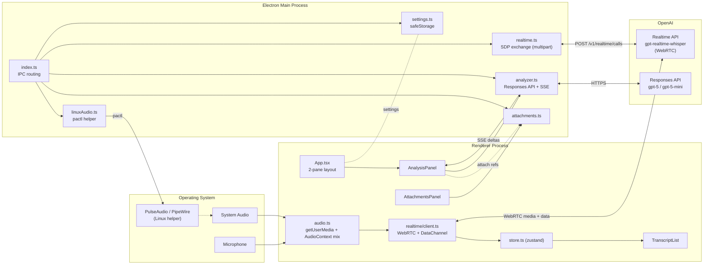

# MeetingAssistant

**日本語** | [English](README.en.md)

会議中のマイク + PC 音声をキャプチャし、OpenAI Realtime API (WebRTC) でリアルタイムに文字起こし、その内容を AI が連続的に整理・議事録化・要確認/提案/決定/アクション抽出までしてくれるデスクトップアプリです。

打ち合わせ中も裏で AI が「いまどこの話をしていて、何が論点で、次に何を聞くべきか」を更新し続けます。終了したら 1 クリックで確定版議事録に変換。

[](https://github.com/TakanariShimbo/meeting-assistant/releases)
[](LICENSE)

---

## 目次

- [機能](#機能)
- [動作環境](#動作環境)
- [インストール](#インストール)
- [初回起動と基本操作](#初回起動と基本操作)
- [設定](#設定)
- [音声モードと Linux 音声セットアップ](#音声モードと-linux-音声セットアップ)
- [添付資料](#添付資料)
- [料金の目安](#料金の目安)
- [トラブルシューティング](#トラブルシューティング)
- [アーキテクチャ](#アーキテクチャ)
- [開発](#開発)
- [リリース](#リリース)
- [既知の制限とロードマップ](#既知の制限とロードマップ)
- [ライセンス](#ライセンス)

---

## 機能

- **リアルタイム文字起こし**（OpenAI Realtime API: `gpt-realtime-whisper`、WebRTC）。話している途中の partial が画面左に live で流れ、確定文は順次積み重なる
- **3 入力モード**: マイクのみ / PC 音声のみ / マイク + PC 音声 結合（Web Audio で AudioContext ミキシング）
- **ライブ分析**: 一定の文字起こし量が溜まるたびに `gpt-5-mini` (デフォルト) を呼び、会議の draft 整理結果を更新
  - カテゴリ判定（hearing / ideation / interview / 1on1 / progress-check / その他）
  - フェーズ（導入 / 議論中 / 論点整理 / 結論模索 / クロージング）
  - 議論フロー（3〜7 ステップ、現在ステップをハイライト）
  - いまの論点 / Key Facts / 議事録 (時系列) / 印象的な発言
  - **要確認**（その場で口に出して聞ける完成文）
  - **提案**（次に進める方向、口に出せる完成文）
  - 決定事項 / Action Items
- **ファイナル分析**: 会議終了時に全文を `gpt-5` (デフォルト) でまとめ直し、確定版議事録 + 次回アジェンダを生成
- **ストリーミング表示**: 構造化出力 (JSON Schema strict) を `text/event-stream` で受け取り、未完成 JSON も best-effort パースで部分的に UI へ反映
- **添付資料**: テキスト / 画像 (PNG/JPEG/WebP) / PDF をドラッグ & ドロップで分析プロンプトに添付。OpenAI のプロンプトキャッシュが効くよう、添付は分析リクエストの安定 prefix として配置
- **Web Search 連携** (任意): Live / Final それぞれで OpenAI の `web_search` ツールを有効化できる
- **設定 GUI**:
  - API キーは OS Keychain で暗号化保存（`safeStorage`）
  - 文字起こし言語ヒント（auto / ja / en / zh / ko / es / fr / de / it / pt / ru）
  - Live / Final それぞれで model + reasoning effort + web search を独立設定
  - マイク / PC 音声デバイスを `enumerateDevices` から選択
- **Linux 音声セットアップ補助**: PulseAudio / PipeWire の null-sink + remap-source + loopback を GUI から 1 クリック構築。「全アプリ自動キャプチャ」トグルでデフォルト sink を一時的に切り替え
- **3 OS パッケージ**: Linux (AppImage / .deb), macOS (dmg, arm64 + x64), Windows (NSIS インストーラ)

---

## 動作環境

| OS | サポート | 必要なもの |
|---|---|---|
| Linux (PulseAudio / PipeWire) | ✅ | システム音声を取りたいなら `pactl` (pulseaudio-utils or pipewire-pulse) |
| macOS 12+ (Intel / Apple Silicon) | ✅ | マイク許可。PC 音声を取りたいなら BlackHole / Loopback 等の仮想オーディオデバイス |
| Windows 10 / 11 | ✅ | マイク許可。PC 音声は Stereo Mix or VB-CABLE 等 |

OpenAI API キーが必須です。Realtime API + Responses API (gpt-5 系) が利用できるアカウントを用意してください。

---

## インストール

最新ビルドは [Releases](https://github.com/TakanariShimbo/meeting-assistant/releases) ページから入手できます。

### Linux

**Debian / Ubuntu (.deb)**（推奨。Activities にも自動登録される）

```bash
sudo apt install ./meeting-assistant_<version>_amd64.deb
```

**AppImage**（どのディストロでも動く portable 実行ファイル）

```bash
chmod +x MeetingAssistant-<version>.AppImage
./MeetingAssistant-<version>.AppImage
```

PC 音声をキャプチャしたい場合は `pactl` が必要です:

```bash
sudo apt install pulseaudio-utils    # or: pipewire-pulse
```

### macOS

| プロセッサ | ファイル |
|---|---|
| Apple Silicon (M1/M2/M3/M4) | `MeetingAssistant-<version>-arm64.dmg` |
| Intel | `MeetingAssistant-<version>.dmg` |

1. dmg を開いて Applications フォルダにドラッグ
2. 初回起動: **未署名アプリ警告** が出るので `Control+クリック → 開く` で承認
3. マイク許可のダイアログを承認
4. PC 音声を取りたい場合は [BlackHole](https://github.com/ExistentialAudio/BlackHole) 等の仮想オーディオデバイスをセットアップしてから、設定画面で「PC 音声」デバイスとして指定

### Windows

`MeetingAssistant-Setup-<version>.exe` をダウンロード → 実行。

- SmartScreen 警告が出たら **詳細情報 → 実行**（未署名のため）
- インストール後はスタートメニューから起動
- PC 音声を取りたい場合は Stereo Mix を有効化、または [VB-CABLE](https://vb-audio.com/Cable/) 等の仮想デバイスを用意

---

## 初回起動と基本操作

1. アプリを起動するとメインウィンドウ（左: 文字起こし / 添付、右: 分析パネル）が開く
2. ヘッダーの **設定** から OpenAI API キーを入力して保存
3. **音声モード** を選択（マイクのみ / PC 音声のみ / マイク + PC 音声）
4. 必要ならデバイスを個別に選択（複数マイク・複数音声出力がある場合）
5. ヘッダーの **開始** ボタン → ステータスが「接続中…」→「接続済み」に
6. 文字起こしが左パネルに流れ始める
7. 一定量たまると右の **分析パネル** に Live 分析カードが順次更新される
8. 会議終了したら **停止** → 分析パネルの **ファイナル分析** ボタンで確定版議事録を生成

中央の縦線をドラッグすると左右パネルの比率を変えられます (`localStorage` に保存)。

---

## 設定

ヘッダーの「設定」から開きます。

| 項目 | 内容 |
|---|---|
| OpenAI API キー | `sk-` で始まる文字列。**保存時に OS Keychain で暗号化**（`safeStorage`）。Keychain が使えない環境では平文 JSON にフォールバックし警告ログを出す |
| 文字起こし言語 | Realtime API に渡す言語ヒント (`audio.input.transcription.language`、ISO-639-1)。**Auto** は自動判定 |
| 音声モード | `マイクのみ` / `PC 音声のみ` / `マイク + PC 音声 結合` |
| マイクデバイス | `enumerateDevices` から取得した入力デバイス。未指定はブラウザのデフォルト |
| PC 音声デバイス | システム音声を流す入力デバイス（Linux: `MeetingAssistant_Capture` / mac: BlackHole / Win: Stereo Mix etc.） |
| Live モデル | `gpt-5` / `gpt-5-mini` (デフォルト) / `gpt-5-nano` |
| Live reasoning effort | `minimal` / `low` (デフォルト) / `medium` / `high` |
| Live Web Search | `web_search` ツールを Live 分析に渡す (デフォルト OFF) |
| Final モデル | 同上。デフォルト `gpt-5` |
| Final reasoning effort | 同上。デフォルト `low` |
| Final Web Search | 同上 (デフォルト OFF) |
| Chat モデル | 同上。デフォルト `gpt-5` |
| Chat reasoning effort | 同上。デフォルト `low` |
| Chat Web Search | 同上 (デフォルト **ON** — 質問に外部知識が必要なケースが多いため) |
| Realtime 指示文 | Realtime API の `instructions` に渡す system prompt（応答モード向け。文字起こしのみなら通常変更不要） |

API キー優先度: **設定ファイル > 環境変数 `OPENAI_API_KEY` > なし**

設定ファイルの保存先:
- Linux: `~/.config/meeting-assistant/settings.json`
- macOS: `~/Library/Application Support/meeting-assistant/settings.json`
- Windows: `%APPDATA%\meeting-assistant\settings.json`

---

## 音声モードと Linux 音声セットアップ

### マイクのみ

特別なセットアップ不要。OS の許可ダイアログを承認するだけ。

### PC 音声のみ / マイク + PC 音声 結合

OS の **入力デバイス** に「システム音声」を流す経路が必要です。

**Linux (PulseAudio / PipeWire)** — 設定画面の「Linux 音声セットアップ」セクションから 1 クリックで構築できます。

内部では以下の 3 つの PulseAudio モジュールをロードします:

| モジュール | 役割 |
|---|---|
| `module-null-sink` (`meeting_assistant`) | 仮想スピーカー。アプリの出力先として指定する |
| `module-remap-source` (`meeting_assistant_capture`) | 仮想スピーカーの monitor を **通常の入力デバイス** として再公開（Chromium は raw monitor を hide するため） |
| `module-loopback` | 仮想 sink → 実スピーカーへ流し戻し（自分でも音が聞こえるように） |

セットアップ後の流れ:

1. アプリの「Linux 音声セットアップ」→ **セットアップ実行**
2. `pavucontrol` の「再生」タブを開く → キャプチャしたい各アプリ（Zoom、ブラウザ等）の出力先を **MeetingAssistant_Sink** に変更
3. 設定画面の「PC 音声デバイス」で **MeetingAssistant_Capture** を選択
4. **全アプリ自動キャプチャ** トグルを ON にすると、デフォルト sink が `MeetingAssistant_Sink` に切り替わり、新規アプリも自動で取れるようになる（停止時に元に戻る）

CLI でやりたい場合は `scripts/setup-linux-audio.sh` を直接実行しても同じ構成になります。

**macOS** — [BlackHole](https://github.com/ExistentialAudio/BlackHole) などの仮想オーディオドライバを別途インストールし、Audio MIDI 設定で Multi-Output Device を作成して BlackHole に流す、というのが定番です。

**Windows** — Stereo Mix を有効化するか、[VB-CABLE](https://vb-audio.com/Cable/) を使ってシステム音声を入力として取れるようにします。

---

## 添付資料

会議資料、過去議事録、関連メモなどを添付すると、Live / Final 分析の文脈として活用されます。

- **追加方法**: 左パネルの「添付」セクションにファイルをドラッグ & ドロップ、または「ファイル追加」ボタン
- **対応形式**:
  - テキスト: `.txt`, `.md`, `.json`, ... → UTF-8 として読む
  - 画像: PNG / JPEG / WebP → `input_image` として OpenAI に渡す
  - PDF: `input_file` として渡す（OpenAI 側で OCR / テキスト抽出）
- **キャッシュ**: 添付は分析リクエストの安定 prefix（独立した user メッセージ）として配置するので、同じ添付セットで複数回分析しても **OpenAI のプロンプトキャッシュが効き** 2 回目以降は添付部分が低コストになる

---

## 料金の目安

実コストはモデル選択・会議の長さ・添付サイズで大きく変わります。デフォルト構成 (`gpt-realtime-whisper` + Live `gpt-5-mini/low` + Final `gpt-5/low` + Chat `gpt-5/low/web` ) の 60 分会議のおおよその目安:

| 項目 | 概算 |
|---|---|
| Realtime 文字起こし | OpenAI Realtime API の音声入力料金。1 時間あたり数百円〜 |
| Live 分析 | 数十回呼ばれる × `gpt-5-mini` の小規模出力。プロンプトキャッシュが効くので 1 回 1〜数円目安 |
| Final 分析 | 1 回。全文 + `gpt-5/low`。会議サイズで変動、数十円〜 |
| Chat | ユーザー操作次第。1 回あたり `gpt-5/low` + transcript + 添付。プロンプトキャッシュが効くので 2 回目以降の同セッション内は安い |

正確な料金は [OpenAI Pricing](https://openai.com/api/pricing/) を参照してください。コスト最適化したい場合は Live モデルを `gpt-5-nano` + `minimal` に、Chat の Web Search を OFF に、Chat/Final モデルを `gpt-5-mini` に落とすと大きく下げられます。

---

## トラブルシューティング

| 症状 | 原因 / 対処 |
|---|---|
| 接続中… のまま進まない | API キーが無効 / Realtime API へのアクセス権なし。設定でキー再確認 |
| `OpenAI API キーが未設定です` | 設定画面でキーを保存、または `OPENAI_API_KEY` を export してから起動 |
| マイクが拾えない | OS のマイク許可、ブラウザの `enumerateDevices` で見えるか確認。Linux なら `arecord -l` |
| PC 音声が無音 | Linux: アプリの出力先が `MeetingAssistant_Sink` になっているか pavucontrol で確認 / mac: BlackHole が入力デバイスとして見えるか / Win: Stereo Mix が有効か |
| Linux で「音声セットアップ実行」が失敗 | `pactl --version` がエラーなく動くか確認。`pulseaudio-utils` または `pipewire-pulse` をインストール |
| 分析がエラーになる | 出ているエラーメッセージを確認。401 = キー無効 / 429 = レート制限 / 400 = モデル名が利用不可（gpt-5 系が有効か） |
| 分析パネルがずっと「reasoning…」 | gpt-5 系の reasoning モデルはまず thinking phase に入る。`high` effort だと数十秒かかることも |
| 起動できない（Linux: sandbox エラー） | 開発時のみ。`npm run dev` は `--no-sandbox` 付き。それでも駄目なら下記の「開発」セクション参照 |

---

## アーキテクチャ



### 責務マトリクス

| モジュール | 受け持つもの | 受け持たないもの |
|---|---|---|
| `main/index.ts` | Electron lifecycle、IPC ハンドラ登録、permission handler、analysis progress emitter の配線 | ビジネスロジック |
| `main/realtime.ts` | OpenAI Realtime API への multipart SDP 交換（API キーは main からのみ送出） | SDP 生成 / メディア管理 |
| `main/analyzer.ts` | Responses API への streaming POST、SSE 解釈、構造化出力 (JSON Schema strict)、partial JSON のベストエフォートパース、progress 配信 | UI 描画 |
| `main/settings.ts` | settings JSON の読み書き、`safeStorage` 暗号化、`OPENAI_API_KEY` フォールバック | UI 描画 |
| `main/attachments.ts` | 添付ファイルのメモリ管理、analyzer 用フォーマット変換、サイズ上限 | ファイル I/O 以外の整形 |
| `main/linuxAudio.ts` | `pactl` を spawn して null-sink / remap-source / loopback の load/unload + デフォルト sink の切替 | macOS / Windows の音声設定 |
| `preload/index.ts` | `contextBridge` 経由で `window.api` を公開 | ビジネスロジック |
| `renderer/src/App.tsx` | 2 ペインレイアウト、Start/Stop、設定オープン、analysis progress 購読 | ビジネスロジック |
| `renderer/src/realtime/client.ts` | WebRTC の `RTCPeerConnection`、`oai-events` データチャネル、Realtime API イベント解釈、`session` JSON の組み立て (RealtimeRG と一致) | API キーの保持 |
| `renderer/src/audio.ts` | `getUserMedia` でマイク / システムを取得、`mixed` モードは `AudioContext` で結合、cleanup 関数を返す | デバイス選択 UI |
| `renderer/src/store.ts` | zustand: 文字起こし状態、分析結果、エラー、analysis progress | I/O |
| `renderer/src/components/*` | TranscriptList / SettingsPanel / AnalysisPanel / AttachmentsPanel / CopyButton / ErrorBoundary | データ取得 |
| `shared/types.ts` | `AppSettings` / `LanguageCode` / `AudioMode` / `LiveModel` / `ReasoningEffort`、Realtime API のモデル定数 (`REALTIME_MODEL`, `TRANSCRIPTION_MODEL`, `VOICE`) | ロジック |
| `shared/analysis.ts` | `LiveAnalysis` / `FinalAnalysis` の型 + `LIVE_ANALYSIS_SCHEMA` / `FINAL_ANALYSIS_SCHEMA` (OpenAI structured output strict) | 分析の実装 |
| `shared/channels.ts` | IPC チャネル名（`<domain>:<verb>`） | ペイロード型 |
| `shared/attachments.ts` | 添付の `kind`/`mime`/`payload` 型 | ファイル管理 |

### IPC チャネル

すべて `src/shared/channels.ts` で定義。`window.api` (preload) 経由で renderer から呼ぶ。

| Channel | 向き | Payload | 用途 |
|---|---|---|---|
| `settings:get` | renderer → main | — | 設定読み込み (invoke) |
| `settings:save` | renderer → main | `SettingsUpdate` | 設定保存 (invoke) |
| `realtime:exchange-sdp` | renderer → main | `SdpExchangeRequest` | WebRTC SDP offer/answer 交換（API キーは main 側だけが知る） |
| `analyze` | renderer → main | `AnalyzeRequest` | Live / Final 分析を起動 |
| `analyze:progress` | main → renderer | `AnalysisProgress` | 分析中の reasoning / output chars / partial result |
| `attachment:list` / `add` / `remove` / `clear` | renderer → main | 添付管理 |
| `linux-audio:status` / `setup` / `teardown` / `set-capture-default` | renderer → main | Linux 音声セットアップ |
| `clipboard:write-text` | renderer → main | テキスト | renderer の navigator.clipboard が失敗する局面のフォールバック |

### Realtime API とのやり取り (WebRTC)

`whisper-anywhere` (WebSocket + 自前 PCM チャンク化) と異なり、こちらは **WebRTC + Realtime API のマルチパート SDP 交換** を使います。理由:

- 会議用途は音声が長時間流れる → WebSocket より WebRTC のほうがブラウザ最適化済みで CPU が低い
- 会話モード（assistant が返事する）を将来追加する余地を残したかった: `autoCreateResponse: false` で文字起こしのみだが、トランシーバは `sendrecv`、データチャンネルもセッション設定もすでに会話モード前提
- SDP の交換時に初期セッション設定 (`session` JSON) を `multipart/form-data` で同時に送れるので、`session.update` 往復が不要

実装は [RealtimeRG](https://github.com/lukasalexanderweber/RealtimeRG) (Kotlin) の `RtcTransport.kt` / `Signaling.kt` / `EventCodec.kt` に意図的に近づけています — Realtime API の安定挙動が確認済みのリファレンスなので、独自の "sensible default" は混ぜずに値を一致させています。

---

## 開発

### 前提

- Node.js 22+（`.nvmrc` 同梱）
- Linux 開発時のみ:
  - `chrome-sandbox` の SUID 設定がされていない環境（多くの dev container や Ubuntu の一部設定）では `npm run dev` 内で `--no-sandbox` を渡しています
  - PC 音声をテストしたいなら `pulseaudio-utils` (または `pipewire-pulse`)

### セットアップ

```bash
nvm use
npm ci
```

### 起動

```bash
# API キーは設定 GUI から保存しておけば再起動後も不要
OPENAI_API_KEY='sk-...' npm run dev
```

### スクリプト

```bash
npm run dev           # electron-vite dev（--no-sandbox 付き）
npm run build         # main / preload / renderer を out/ へバンドル
npm run typecheck     # tsc 型チェック (node + web)

npm run pack:dir      # 開発用に release/linux-unpacked/ に展開のみ
npm run pack:linux    # AppImage + .deb 生成
npm run pack:mac      # dmg + zip 生成（macOS でのみ実行可）
npm run pack:win      # NSIS exe 生成（Windows 推奨）
```

### ソース構成

```text
src/
├─ main/                       # Electron メインプロセス
│  ├─ index.ts                 # bootstrap + IPC routing + permission handler
│  ├─ realtime.ts              # OpenAI Realtime API への multipart SDP exchange
│  ├─ analyzer.ts              # Responses API streaming + structured output + partial JSON parser
│  ├─ settings.ts              # safeStorage 暗号化 + JSON 永続化
│  ├─ attachments.ts           # 添付資料の保管 + analyzer 用整形
│  └─ linuxAudio.ts            # pactl helper (null-sink / remap-source / loopback)
│
├─ preload/
│  └─ index.ts                 # contextBridge で window.api を公開
│
├─ renderer/
│  ├─ index.html
│  └─ src/
│     ├─ App.tsx               # 2 ペインレイアウト + Start/Stop
│     ├─ main.tsx
│     ├─ App.css
│     ├─ store.ts              # zustand
│     ├─ audio.ts              # getUserMedia + AudioContext mix
│     ├─ realtime/client.ts    # WebRTC client (RealtimeRG mirror)
│     ├─ utils/serialize.ts
│     ├─ global.d.ts
│     └─ components/
│        ├─ TranscriptList.tsx
│        ├─ AnalysisPanel.tsx
│        ├─ AttachmentsPanel.tsx
│        ├─ SettingsPanel.tsx
│        ├─ CopyButton.tsx
│        └─ ErrorBoundary.tsx
│
└─ shared/
   ├─ types.ts                 # AppSettings / LanguageCode / AudioMode / モデル定数
   ├─ analysis.ts              # LiveAnalysis / FinalAnalysis 型 + JSON Schema
   ├─ channels.ts              # IPC チャネル名
   └─ attachments.ts           # 添付の型

scripts/
└─ setup-linux-audio.sh        # GUI セットアップと等価なシェルスクリプト

build/
├─ icon.png                    # 1024px master
├─ icon.ico                    # Windows
└─ icons/                      # Linux hicolor 16..1024
```

---

## リリース

1. タグを打って push:
   ```bash
   git tag v0.1.0
   git push origin v0.1.0
   ```
2. GitHub Actions (`.github/workflows/release.yml`) が tag から version を抽出 → `package.json` を同期 → ubuntu / macOS / windows ランナーで並行ビルド → **draft** リリースに各成果物を自動アップロード
3. GitHub の Releases 画面で内容を確認 → **Publish release**

> `package.json` の `version` を手動で bump する必要はありません。タグから自動同期されます。

---

## 既知の制限とロードマップ

**現状の制限**

- macOS / Windows ビルドは **未署名**（Gatekeeper / SmartScreen の警告が出る）
- 文字起こし履歴のディスク永続化なし（アプリ終了で消える）
- 話者分離なし（マイク 1 本前提。話者推測は notable quotes 抽出時のみ）
- 会話モード (assistant が音声で返事) は未実装（実装の余地は残してある: `autoCreateResponse: true` + `response.create`）

**ロードマップ**

- 文字起こし + 議事録のエクスポート (Markdown / Notion / Drive)
- 過去会議の一覧と再分析
- 会話モード（割り込み可能なリアルタイム AI 同席者）
- macOS / Windows のコード署名

---

## ライセンス

[MIT License](LICENSE) — © 2026 Takanari Shimbo
